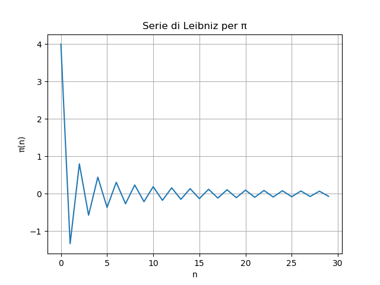

# Serie di Leibniz per π

In matematica, la formula di Madhava-Leibniz per π è una serie convergente, chiamata più correttamente Serie di Madhava–Leibniz essendo un caso particolare di una più generale serie per la tangente inversa, di cui il primo scopritore fu appunto Madhava di Sangamagrama. È nota anche come serie di Gregory per π, dal nome del matematico scozzese James Gregory che la riscoprì qualche anno prima di Leibniz stesso.

Essa afferma che la somma infinita a segni alterni di tutti i reciproci dei numeri naturali dispari, partendo da più uno, è uguale a un quarto del pi greco:

  

Se si pone sull'asse delle ascisse _n_ (variabile della somma) e sull'asse delle ordinate _π(n)_ (si intende che se si moltiplicano per 4 i termini della serie allora si ottiene π e non più π/4) la rappresentazione grafica della _Serie di Leibniz_ è:

  

# Per maggiori informazioni

Spiegazione online Serie di Leibniz per π [youtube]: https://youtu.be/ksMgFxMEx2o

Serie di Leibniz per π [Teoria]: https://it.wikipedia.org/wiki/Formula_di_Leibniz_per_pi

Created By Antonio Bernardini Copyright© 2020
